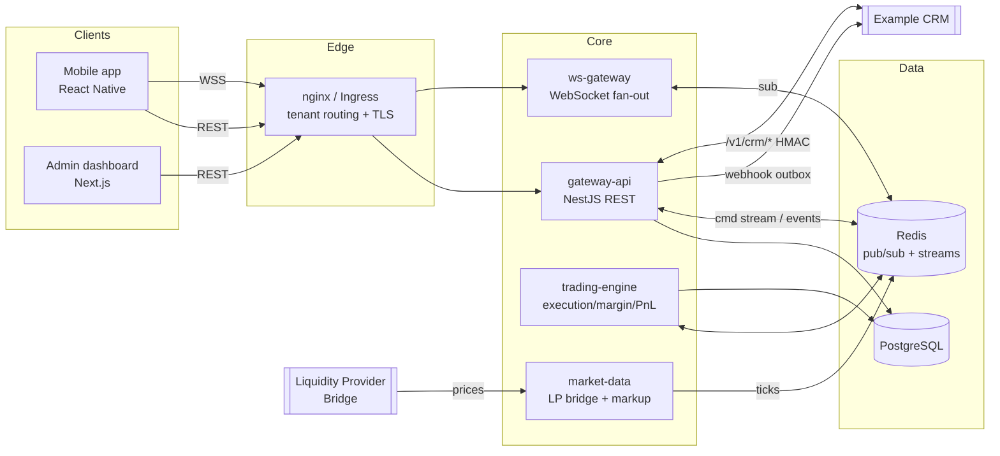

# 1. System Architecture

## Overview

B-Trader is an event-driven, horizontally scalable trading platform composed of small services that communicate over Redis (pub/sub for hot data, streams for durable commands) and share a single PostgreSQL database as the system of record. It serves multiple broker brands (tenants) from one deployment, each with isolated data, branding, and configuration. It is a peer system to the Example CRM — they share no database; all interaction is over the signed `/v1/crm/*` API.

## Services

**gateway-api (NestJS).** The public REST surface for mobile, admin, and CRM. Handles authentication (JWT + refresh), RBAC, multi-tenant resolution, rate limiting, validation, Swagger docs, and audit. It runs an **in-process `TradingEngine`** for the low-latency synchronous execution path (an order POST returns a real fill), while the standalone engine service handles tick-driven evaluation. Both share the DB, so either path is authoritative.

**trading-engine.** Owns the trading math: order validation, market/pending execution, margin requirement, floating and realized P&L, equity/free-margin/margin-level, SL/TP triggering, and stop-out liquidation. The pure-function core (`calc.ts`) is fully unit-tested and has no I/O. The service subscribes to ticks and re-evaluates pending orders, protective stops, and stop-out on every price update. It scales horizontally by sharding tenants across replicas.

**market-data.** Connects to a configured **LP bridge adapter** (a swappable interface — mock, generic WebSocket, or FIX), normalizes upstream ticks, applies each tenant's admin-configured markup and symbol enablement, and publishes per-tenant ticks to Redis (`bt:{tenantId}:ticks`). Only admin-enabled symbols are ever distributed.

**ws-gateway.** The single realtime endpoint clients connect to. It authenticates the socket with the access JWT, scopes every subscription to the user's tenant, and fans out only the symbols and accounts a client subscribed to. Stateless — any replica can serve any client because all data flows through Redis.

## Data flow: placing a market order

1. Mobile sends `POST /v1/orders` with the access token; nginx forwards the original host so the gateway resolves the tenant.
2. `JwtAuthGuard` verifies the token, enforces RBAC, and pins the principal to the tenant.
3. `TradingEngine.placeOrder` validates the symbol (enabled, session open), normalizes volume to lot step, enforces risk limits, reads the live price from the Redis-fed `PriceSource`, computes required margin, and checks free margin.
4. Inside one DB transaction it creates the `Position`, the `Order` (FILLED), and an immutable `Deal`, then updates the account.
5. It recomputes account aggregates, emits `ACCOUNT_UPDATE` / `POSITION_UPDATE` to Redis (ws-gateway fans them to the client), and enqueues a `position.opened` event in the CRM outbox.
6. The HTTP response returns the fill synchronously.

## Latency strategy (below MT5 retail standards)

The hot path holds prices in process memory (`PriceSource`, hydrated from Redis pub/sub) so execution never makes a network hop for a quote. Order validation and margin math are pure functions over in-memory state. The only blocking I/O on the critical path is a single DB transaction; in production this is a primary with synchronous replication and connection pooling (PgBouncer). Tick fan-out is pub/sub, not polling — the CRM's previous 30-second balance poll is replaced by push events through the outbox/webhook. Target p99 order-acknowledge is in the low tens of milliseconds intra-region.

## Failure & high availability

Every service is stateless except the engine's per-tenant in-memory book, which is always reconstructable from PostgreSQL. Redis is the message fabric; if a node restarts it rehydrates ticks within one tick interval. The CRM outbox guarantees at-least-once delivery of trading events with retry/backoff, so a CRM outage never loses data. Postgres runs primary + replicas with automated failover; Redis runs in Sentinel/Cluster mode. See [08-deployment](08-deployment.md).
